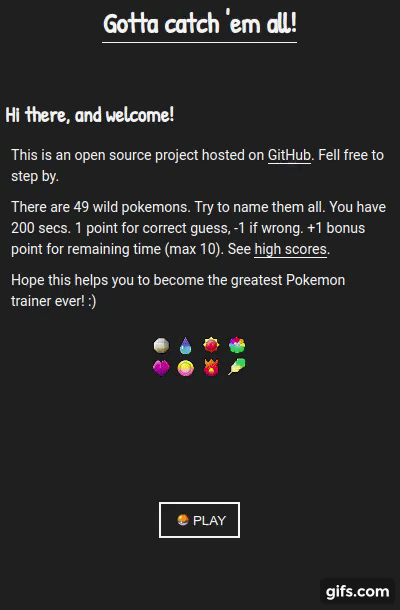

# CJ gotta catch 'em all!

.

[Coding Garden](https://www.youtube.com/channel/UCLNgu_OupwoeESgtab33CCw) is a youtube channel that teaches people on how to code with JavaScript. The host of this channel is a nice guy know as CJ.

One day, on a live stream, he gave a challenge to his subscribers: build a simple website that fetch some data from a public API that followed [some rules](https://github.com/CodingGarden/seedling-school-01-frontend-project).

The goal of this challenge was to teach the basics on web development. Well... I have some experience on web dev and I wanted to participate so CJ would do a nice live review on my code and that would make me very happy! :)

Therefore I decided to set up some crazy Stretch Goals on my project, but nothing too deep. The focus is to let others learn from it.

Besides it's being fun to develop, this will be a nice add on to a online portfolio.

# What is required

A good editor. I recommend [VsCode](https://code.visualstudio.com/).

NPM installed. Take a look on [NVM - Node Version Manager](https://github.com/nvm-sh/nvm).

# How to run local on dev server

1. Run '**npm install**' to download the dev requirements.

1. Run '**npm start**'. This will start web-pack-dev server and open the web page for you.

# How to build and run

1. Run '**npm install**' to download the dev requirements.

1. Run '**npm run build**' or '**npm run watch**'. Both will transpile Typescript to a **./dist** folder.

1. Run **LiveServer** (it's a extension from VsCode that hooks a live server on port 5500.

# The state of the project

Finished the first version on it.

I may plan for future versions.

# Architectural thoughts

As a general rule set by CJ, only plain Javascript was allowed, so no Framework or library was used unless what's required to transpile Typescript and Sass.

- Build process with [Webpack](https://webpack.js.org/) to transpile [Typescript](https://www.typescriptlang.org/) code.
  - This must provide both build process and live transpile on change detection.
- Semantic HTML
  - HTML, as a markup language, is semantic in nature. That means every tag has it's goal.
- [Sass](https://sass-lang.com/).
  - Sass give us the ability to use nested rules, mixins, functions and much more.
- Sprite images.
  - Sprite with Sass is soo good! :)
  - Downloaded from [Veekun](https://veekun.com/dex/downloads).
- CSS grid.
  - No need for column based site made with a css framework nowadays.
- A good documentation.
  - The clean code you write is the best documentation ever.
  - Even so, some additional and clever writing is always welcomed.
- A good project structure and organization.
  - /assets for images.
  - /sass for styling.
  - /src for main Typescript code.
  - /src/lib for shared Typescript code.
  - /view for web components
    - Every web component has it's own folder. On there, there is the html file and .ts file.
- Tests with Jest.
  - All test files ends with **.spec.ts**.
  - I recommend you to use the VsCode Jest extension. With it enabled, all tests are made realtime with the possibility to debug on the fly (sometimes it crashes, if so reload window).
- Mobile first
  - Unless on very specific cases, this is a must for every project nowadays.
- WebComponents (with Typescript!)
  - Web Component is somehow a way to let us extends the HTML elements to create new custom and reusable HTML.
  - Separation of concern between presentation (template) and controller.
  - No shadow CSS was used.
- [SPA](https://en.wikipedia.org/wiki/Single-page_application).
- Observer Pattern to share state.
  - This means that the state is shared between subscription as such on Observer Pattern. For example, whatever component/class that has a shareable state provides a subscription so others can be notified on this state change.
- Mix between an OO approach and functional programming.
- UI animation.

What I may add:

- PWA.

# Last but not least

If you liked this repo, give it a star! :)
